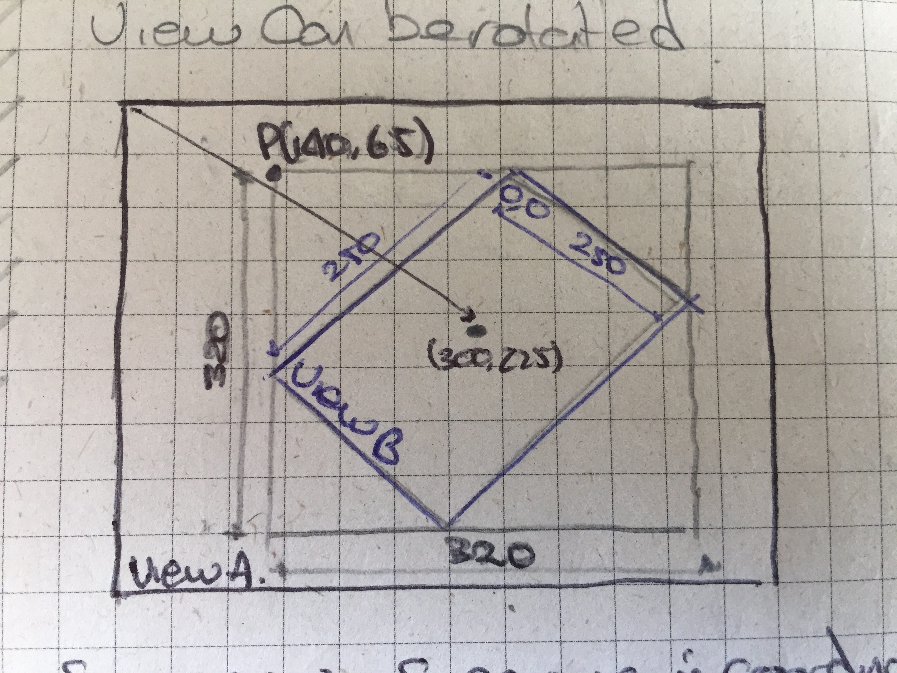

#The iOS Development Quick Reference Guide

This is a quick reference guide to iOS developers. Consider it as an extended cheatsheet or a small, more understantable documentation. The purpose of this guide is to be a **simple**, improved by everyone with the best concepts, practices and code.

This guide is **not** completed yet. Do not like something? improve it. 

For styling, we use the [NYTimes Objective-C Style Guide](https://github.com/NYTimes/objective-c-style-guide)


## Introduction

Here are some of the docs used to create this guide. 

## Table of Contents

* [Something ](#stu-ff)


#Objective-C
Objective C: a direct superset of C

* **blocks:** code that is passed as an object. When something happens, you can run that code. Categories: Extend existing classes. 
* **Protocols:** defines messaging contracts. Any class can  chose to implement int. 
You have to implement the methods specified in the protocol. 
* **Exceptions:** Programming errors. All other errors including runtime are NSErrors. 
* **Constants:** 
```objc #define PI 3.14 ```
```objc static const float PI=3.14```
* **closures:**  code in a variable
* **lazy var:** created when first used, In the getter. 
* **Singleton:** Special kind of object that exists only once in an app
* **Static Var:** exists only once in our app
* **@lazy:** Instance is created when the object is first called


##Classes 
Classes are blueprints for objects, that are its instances. 

* An app is a network of objects. 
* Classes inherit from other classes

**For example:**  

```objc
@interface ObjectiveCStuff : NSObject
    
    //ObjectiveCStuff inherits basic attributes and methods from NSObject
    
@end
```

* If ObjectiveCStuff implements a method already defined in NSObject, it overrides it.

* Calling overriden methods on ObjectiveCStuffChild 
```objc[self sayHello];```

* Calling parent methods
```objc[super sayHello];```

* Root classes defines the basic functionality. Such as NSObject.
* Keep inheritance in mind to know what an object can do.

**For Example:**

1. NSObject: Basic Framework
2. UIResponder: Responds to taps, shakes, user interactions
3. UIView: Displays on screen.
4. UIControl: Behavior of iOS controls.
5. UIButton

**Interface:** Declares how an object can be used.

**.h file** (header) is the public API of a class (interface). viewable methods and properties of the class

**.m file** (implementation)

\*Classnames should have a 3 letter prefix to avoid duplicates.

**For Example:**

```objc
XYZPerson.h
@interface XYZPerson:NSObject
@property NSString *name;
@end

XYZPerson.m
#import “XYZPerson.h”
@interface XYZPerson()
	//here go private file declarations. 
@end
@implementation  XYZPerson
-(void) sayHello{}
@end
```


##Categories: 
Categories extend the functionality of a class to it and its subclasses.

**For Example:**  Declaring an interface for the original object, with the new name in parentheses

```objc
@interface ObjectiveCStuff (ObjectiveCStuff_ExtensionThroughCategory)
- (NSString *)extraMethod; //this method will now be available to all ObjectiveCStuff  and ObjectiveCStuff child instances.
@end
```
```objc
@implementation ObjectiveCStuff(ObjectiveCStuff_ExtensionThroughCategory)
- (NSString *)extraMethod { return @”hi”;}
@end
```

##Properties: 
Hold an object’s values and control access. 

* Property attributes indicate whether it is readonly.
* All properties start with a value of 0 (or nil in pointers)
* Initializing them in the header is called lazy instantiation.
* In swift, properties must be initialized at the creation of object. 

* Properties declared in the header file are public
                 declared in the implantation are private.

**Standard declaration**  By default, properties  are strong and atomic.
`@property NSString *firstName;`

**Weak reference** Variables you only need as long as someone is also pointing to it. 

* Means a relation in which the object does not own. 
* The object is deleted if there are no other strong references to it.
```objc @property (weak) id delegate; ```

**Strong reference** Keep the object until all strong pointers are disconnected. 
* They own the object and it won't be deleted until the owner is deleted.

**Copy**: Hold on to the value of the object at the point in time when I am assigning it to my property.

* Otherwise, a mutable string could be assigned to an immutable string property, because mutablestring is a child class

```objc @property (copy)NSString *Name2; ```

**Retain** Hold on to the object 
* We don't care what its internal values currently are or will be in the future.

**Nonatomic** Not thread safe. 
* Property attribute specifies synthesized accessors simply to set or return a value directly.
* No guarantees about what happens if that same value is accessed simultaneously from different threads.
* It’s faster to access a nonatomic property than an atomic one

```objc @property(nonatomic) NSString *Name; ```

\*Multithreading should not be many threads to an object. It should be model in one, view in other thread and controller in other, talking to each other.

**Synthesize**

```objc @synthesize firstName = ivar_firstName; ``` Makes the \_firstname backing var of the firstName property to be called ivar_firstName.

```objc @synthesize firstName = _firstName; ``` *used only when you declare the properties getters AND setters explicitly, for the firstName property. 

**For Example:** Property, defining own getters and setters.

```objc
@property NSString *name; //on interface
@synthesize name = _name;  //on header, lets the compiler know the varname
```

**Setter method** 

```objc
- (void) setName:(NSString *)n {
_name = [n uppercaseString];
}
```

**Getter method**

```objc
- (NSString*) name {
return _name;
}
```

**Readonly** Doesn’t have a setter.

```objc @property (readonly) NSDate *dateOfBirth; ```

* A property can be declared as readonly in the header and in the implementation, so it has an internal setter.

**Specifying getter name** usually done in booleans.

```objc
@property(nonatomic, getter=isTaken) BOOL *taken;
```


##Variables
**Values and collections** are Cocoa objects
Objective C supports C primitive types

**Int** should be used in loops
```objc int someInteger=0; ```

###Values

**NSString** Class used for strings of characters

```objc
NSString *someString = @"Hello, World!";
NSNumber *myBOOL = @YES;
NSNumber *myFloat = @3.14f;
NSNumber *myInt = @42;
NSNumber *myInt2 = @(84 / 2);
```

**NSNumber** is an object, it is slow.  It can wrap different types of numbers

**NSInteger** use this one always. its a platform adaptive type of scalar, especially when passing between functions

**NSUInteger** NSInteger that is only positive.

**Collections**

```objc
NSArray
	   @[@"♠︎",@"♣︎",@"♥︎",@"♦︎"];
```

**NSSet**

**NSDictionary** immutable collection of objects looked by key (hash table) that holds objects strongly

```objc
@{key:value, key2:value}
NSDictionary *colors =@{ @“green”:[UIColor greenColor]}
```

***Methods***
```objc
something=colors[@“green”]
(id)objectForKey:(id)key
```
* key is an object and must implement has: and isEqual: NSStrings are good because they hash based on their chars
//dont rely on NSObject's has and isEqual methods

**looping**

```objc
for id key in dictionary{
dictioanary[key].doSomething
 }
```

**PropertyList** Collection of collections

* ”Property list” it is a phrase not an object. 
* Holds NSArray NSDict, NSNum, NSStr, NSDate, NSdata
* NSarray is PL if its members are PLS => like array of strings.
* NSDict if both keys+values are PLS.
* SDK has methods that operate on propertylist 
  * Example: writeToFile can be sent to an array or dict that contains property list objects.

* A **local variable** is allocated on the **stack**
* **Objects** are allocated on the heap.
* An object often needs to stay alive longer than the original variable that was created to keep track of it, so an object’s memory is allocated and deallocated dynamically.
* Variables declared at the top of the file are instance vars, like properties, without accessors.

**Initializing**  

```objc
NSObject *newObject = [[NSObject alloc] init];
```

*alloc saves memory for the object and sets memory spaces to zero
*init makes sure all values are initialized properly.

**Factory method** shorter way, used when no args are needed. 

```objc  
NSObject *newObject2 = [NSObject new];     
```
   
**Initialize with value**
```objc
NSNumber *magicNumber = [[NSNumber alloc] initWithInt:42];  //NSNumber is Immutable
NSNumber *magicNumber2 = [NSNumber numberWithInt:42]; //factory method. Same but in less code.
```

**IMPORTANT**
* On objective C, values are not changed.
```objc
NSString *c = @"a";
NSString *b =c;  // objects are copied, they don't point to the same object
c=@"B";  // a NEW string is assigned to b. The last value is not modified, it is discarded.
NSMutableString *e = @"a"; //Not discarded if object is mutable
e=@"d"; //original is modified.
```

###Comparing variables

Comparing integers test if they are equal
    ```objc
    if (someInteger == 42) {}
    ```

Checks if two pointers are pointing at the SAME object, NOT if they have the same value.
```objc
    if (myFloat == myInt2) {}
    ```
    
Checks if they have the same value
```objc
    if ([myFloat isEqual:myInt2]) {}
    ```
    
Comare if Int is less than myInt2
```objc
    if ([myInt compare:myInt2] == NSOrderedAscending) {}
    ```
    
Check if an object is not null
```objc
if (myInt) {} // somePerson points to an object
```
    
    
##Methods
Objects send messages by calling methods on an object.

```objc
-(void)someMethodWithFirstValue:(type *)value1 secondValue:(type2 *)value2;
```
- (ReturnType)MethodNameWithFirstValue:(Arg1Type)arg secondValue(Arg2Type)arg2;
 
* Method Name is: someMethodWithFirstValue:secondValue:
* value1 and value2 are the names used in the implementation to access the values supplied when the method is called, as if they were variables.

* (-) **Instance** method. It can be called on any instance.
* (+) **Class method** Normally these are Utilities and initializers.

* Instance Methods are used for:
 * Creating an object:

```objc 
+(void)person{}
```

  * Utilities: Eg: Returning max value class can get. 

**Public** methods are declared in the public interface and so can be seen and called by other objects. Their corresponding implementation resides in the implementation file and can’t be seen by other objects. 

**Private** methods have only an implementation and are internal to the class, meaning they’re only available to call inside the class implementation

* There aren’t optional arguments on Objective-C.

**Calling methods**
One arg ```objc [self sayHello]; ```
Multiple args ```objc [self initWithFirstName:aFirstName lastName:aLastName dateOfBirth:nil]; ```


##Looping

* Always use ints in loops instead of NSNumbers. 

**For in** fast enumeration	 	 	 		
```objc				
for (Card *card in otherCards) {
   score += 1;				
} 
```

**For**


##Init 
```objc
-(instanceType)init{}
```

* instanceType: Because it is inherited from NSObject.
* Returns an object that is of the same type of the class it was called in. 
* Always initialize parent classes with :

```objc
self=[super init];
if(self){
	//continue initializing
}
return self;
```

Example: Initialize a PlayingCardDeck by iterating the valid cards from PlayingCard adding cards to itself if class is a deck. 

##MVC

###Model: 
what your app is

* Doesn’t know about the view
* Model =>controller. it broadcasts info to anyone. Notification and key value observing.  Controller listens and asks the model for data.

###Controller
how the model is presented onscreen =>Specific to how your view works

* Interprets and format content to the view.
controller => model. (Controller has a model) Unlimited one way communication
controller =(outlet)> view. Same unlimited one way com.
			
###view
Controller’s minions(stuff used to build the view) Generic
view -> controller. 
* In a very structured, standard way, the controller can be a target that is activated by the action in the view.

* Sometimes the View needs to synchronize with the Controller. 
1. The Controller sets itself as the View’s delegate. 
2. The delegate is set via a protocol (i.e. it’s “blind” to class). 
3. will, should, did. like user did scroll	
* Views can have a protocol to know about the data they hold. 
* They dont own it with instance variables.  They don’t have the songs for example on a list. 
* Controllers are almost always the data source. 
* View asks for count, data at:, number. Sets the scroller to the list and then only asks for data at.
* They are displayed on a generic list, and get data from the model. 
* Delegate uses Protocol: blind way to talk to another object

* NEVER connect model to view

* An mvc can use another mvc as part of another view. Ex: calendar year, month view, day view, appointment view.  All are MVCs and the last ones are minions of the first. Same with tabbars. Each tabbarbutton is a minion with an mvc. They are connected a the controllers. Also, some of the models can communicate or be shared.

**Model**

* GamePlay (The model is the what of the app) It doesn’t know UI. 
* Card
* Deck


**Controller**

* Has a property of type GamePlay.
* Has a property of type Deck.
* ViewController. Displays the model on the view

**View**

* Does not know about the model. 

---

#iOS

##Autolayout:
-No constraint: Stuff only appears if it fits in the screen
-Control-Drag label to border to make constraints. 
*Always try to stick to the blue lines.

To fix constraint issues, cluck on document outline, issues and the yellow triangle. 
-Update constraints:Forces into what you specified
-Reset to suggested Constraints: Moves it into the blue line.
-Update Frame: Moves it into where it should be.

*Many IBOutlets can have the same method as their action. 
Copying a button also copies the targets.

**prepareForSegue:** When a button is clicked, what happens then.  

**IBAction:** Connection that runs a method.
**IBOutlet:** Connection through property. Allows to modify the outlet.
Outlet collections are NSArray  properties
- In Xcode: collections can only have one type of object. like button
*outlets are Strong because only our controlle points to it. 
Control drag all desired objects into propery.	

##Core Data 

**Entity**(table):  You specify an entity to filter the managed objects.
NSEntityDescription - Thought of as the "class" of a managed object. It defines any attributes, relationships and fetched properties that a managed object should have.
**ManagedObject**(row): a record from a persistent store (like registers on a table) and are Entity Instances.
-NSManagedObject - The core unit of Core Data. These are your model objects that hold your data. You set the attributes, relationships etc. on them.
-NSManagedObjectModel - This represent the data model to use for your data.
**ManagedObjectContext:** where instances (ManagedObjects) exist. This is the in memory "scratch pad". It is where you query for objects (using NSFetchRequests), create objects, delete objects etc. 
**PersistentStoreCoordinator:** This handles the loading of data to and from disk. 
**EntityDescription:** Like the table on a relational DB
**FetchRequest:** a query to the db
**FetchRequestController:** Takes the fetch request and executes it.

When creating core data in the xcdatamodel, click on Edit, create NSManagedObjectSubclass with promitive types to handle the model. 

To insert an object into the ManagedObjectContext, we use NSEntityDescription.


##WHATISTHIS

[NSArray componentsJoinedByString:@””];
[NSString mutableCopy];
*Messages can be sent to nil, returning nil ⇔ 0
	0 is nil or NO
	1 is YES

CGPoint *p = [object getLocation];   //p is undefined, not nil careful with C structs.

**id:** pointer to unknown type. It is a pointer, no * needed.

**Syntactic Sugar:** Syntax that will be used to warn you, but not used at runtime. 
	like IBOutlet, or casting

	Casting: telling the compiler that some object will be of type, doesn’t run code.
NSString *hello = @”hello”;
Ship *helloShip = (Ship *) hello; //The underlined part is casting

###Dynamic Binding: 
Using the id so the compiler will get its type at runtime. 

Protecting from id:
Introspection: Asking the object of what type it is, and if it responds to a message.
-isKindOfClass: //for type of class meaning it or inherited. 
-isMemberOfClass: //of exact class. 
	Ex: check if it is sting [____ isKindOfClass:[NSString class]];
-respondsToSelector: //has method

###SEL Selector: 
Identifier for method name

@Selector(methodName(arg1:3 arg2:object))
object.respondsTo@( );
SEL selector = @();

**Protocols:** specifying methods that ofbects that implement it must respond to.

##Foundation

###NSObject 
Base Object class

-(NSString)description; 
Used by NSLog(@”%@”);
%@ calls [object description];
*On custom objects, it is useful to override the description for programming.

-copy; //immutable copy
-immutableCopy; 
*Only certain classes implement this 

###NSArray: 
Immutable array

References to the contained objects are Strong.
-count
-objectindex //can rise indesOutOfBounds
-lastObject / firstObject //throw nil if size is 0
-sortedArrayUsingSelector
-[array makeObjectsPerformSelector:selector]
-[array  componentsJoinedByString:@””]

###NSMutableArray:

-[mutableArray arrayWithCapacity]  //Optimizing size for performance. Not a definite size.
-[mutableArray add]
-[mutableArray insert]
-[mutableArray remove]

###Enumeration:

for(NSString *string in myArray){ //Underlined part is casting
	//do something with string. 
}

###NSNumber: 
Wraps primitive types: ints, floats, bools. Usually, to place inside array.

NSNumber     *three = @3;
		*num= @(C_enum)
		*bool=@(YES);
		
###NSValue: 

Encapsulates more complex types than primitives
* For non-objects, non-primities such as C-Structs.
-Most of the time you can use strings for these instead.

###NSData: 
Bag of bits

* Used to save, store, transmit raw data.

###NSDate 
Stores dates. 

Use with the help of:

* NSCalendar
* NSDateFormatter
* NSDateComponent

*Complicated to place in UI due to many formats around the world. 

###NSSet: 
Collection of unique objects.

* No ordering

[nsset member:object] returns an object if the set has it. 

###NSOrderedSet: 
Set of ordered distinct objects

###Dictionary: 
Collection of key-value pairs.

###PropertyLists: 

**FOr Example:**

**NSUserDetails** small database of PropertyLists
Basically a dictionary that persists on launch app.
Holds details like user prefs.
standardUserDefaults=[[NSUserDefaults standardUserDefaults] setObject:myArray forKey:@"myArray"];
-Only one of this exists through app
-setObjectForKey
-setDoubleForKey

[NSUserDefaults standardUserDefaults synchronize]  //stores the stuff. Always call it after.

###NSRange: 
* C-Struct
-Represents a range in an anrray or string
It has two properties: Location+length
Returns NSNot found if it fails
NSRange pointer: used as a method parameter. 

*Pass as reference(Pass through giving the address of the object in memory)
*Passing by value(Passing a connected copy of the original)

###UIColor
 Object for Color
RGB
Pattern as a color
HSB
Alpha
Standard: [UIColor greenColor]
System: [UIColor lightColor]

###UIFont
User content: E.x. = [UIFont preferredFontForTextStyle: UIFontTextStyleBody];
Other: UIFont….headline, caption1, footnote.

System: ex. used for buttons.
	-SystemFontOfSize (CGFloat)
	-SystemBold
	*Not for content. 

###UIFontDescription###

-Designed by artists.
-Fonts don’t always fit into a categorization
-This class maps fonts into a category.


###NSAttribtedString:

**How text looks on screen**
Like an NSString, but with attributes like underline stored in a dictionary.
[attributedString string]; // returns a string, but very volatile. If needed more than once, make a copy.


###MutableAttributedString:

addAttributeAtRange.
removeAttribute
[attributedString NSMutableString ] //changes in the resulting mutable string will be reflected in the attributed one. They go together. 

Attributes
@{NSFontAttributeName:[UIFontPreferredFontWithTextStyle:UIFontTextStyleHeader]}
-NSForegroundColorAttributeName
@-5 //fill and stroke font
@5 stroke (Outline)
-NSBackgroundColor

can use attributed strings in:
-buttons
-labels
-UITextView() //like a libbel, but user editable

Button: SetAttributedTitle:

*Draging Strings: All strings know how to go on screen
(void)drawInRect(CGRect)


###UILabel

-setAttributedtext 
-getAttributedtext
-Create mutable copy, modify, enum

###UITextView 

Multiline text, mutable attributed string viewer: editable+selectable by users.
-NSText storage: Set attributes user can edit. 
-Font: sets the font for each char 
*You can even do a bezier path for inclusion or exclusion areas of text. 


###TextKit Attributes are set by character.
	strike: outline
	fill: fill.

textView addAttributes:@{NSStrokeWidthAttributeName:@-3, NSSTrokeColorAttributeNone:[UIColor redColor]} range: setlf.bodySelectedRange
-remove attribute

###Enum list of int values


##View Controller Lifecycle

Messages sent to the controller as stuff happens like: initialize, come on screen, bounds change.

View instantiated from storyboard
AwakeFromnib is called
Outlets are st
ViewDidload is called
view{will/did}layout subviews are called
viiew{will/did}appear //view appears finally on screen
view{will/did} disappear//view is offscreen now
*Memory warnings may appear at any time.

1. **ViewDidLoad:** initialization here. Where you do init for controls, properties, stuff
**Outlets are already set
**Geometry not set yet. 
-Called once
-call method on parents [super viewDidLoad]

2. **ViewWillAppear:** called when its about to enter the screen.
-NO one-time initialization here.
*Performance optimization may be done by not setting stuff in viewWillAppear (called at the beginning, when the view loads) and doing so just about it appears (lazy loading?)
-Set something related to data that may have changed while the controller was away. Maybe getting changes from the model.
-No geometry Here: view geometry is already set. But the best practice is not setting it here.

3. **ViewWillDisappear** Make the controller stop using resources (specially heap Memory)
-[super viewWillDisappear:animated] //always call parent method
-Useful for storing changes like: [self rememberScrollPosition] //implemt method yourself.
*Nothing too time consuming. It must disappear quickly.

4. **DidMethods:**
-viewDidAppear
-viewDidDisappear //Save Data?


**Geometry:**
-(void)view{Did|Will}LayoutSubview:    This is where to put geometry-related code.
-Called when a view’s frame is changed e.g. autorotating.
-Most of the time handled by autolayout.
*Between did and Will, autolayout occurs
-Move stuff on Did.

##Autorotation **

Requirements:
[ViewController shouldAutoRotate] // should return YES
[ViewController supportedInterfaceOrientations] returns enum with possible orientations => landscape, portraitUpsideDown.
App supports the desired orientation (Defined in info.plist)
*It is possible to animate rotations by yourself, but not common. 

**Low Memory Situations** didReceiveMemoryWarning
-try and free memory in the heap
-set strong pointers to nil, specially images and sounds
*small arrays, strings etc do not account much memory
-If the controller is not on screen, you can dump data(media specially) and then recreate frim the filesystem.
-Ypu should probably already do this on viewWillDisappear
**Why Free memory?** iOS can shut your app if it occupies too much memory, users  dont like apps that slow things down and rate it negatively.

###Creation: 
start of the lifecycle. 
Most views are created by unfreezing objects from storyboards.
-The AwakeFromNib: method is called. 
	-sent to all objects in the soryboard
	-Outlets are not set
	-If possible, don’t place stuff here.
It is possible to create controllers with alloc, init but it is not common.


##NSNotification

-Way of communicating between objects.
-The “radio Station”
Get the default notification center:    [NSNotificationCenter defaultCenter] //shared instance to tune on to the station.
-addObserver: (id)observer:selector:sender:
observer:   //the object that wants to listen (self usually)
selector: //Method in the observer that should be called if broadcaster calls.
sender: //whose changes are you interested in

//Method to receive broadcasts
-(void)methodToInvokeIfSomethingHappens:(NSNotification *)notification
{notification.name //name of the notification
notification.object //object sending the notification
notification.userInfo //notification. Specific about what happened }

//Ways to remove from notifications.
[center removeObserver:self]
[center name:UICOntentCategoryDidChange object:nil]
*not removing the listener can cause a crash because NotificationCenter keeps an UnsafeRetained pointer to the object.

Usuarlly, you should remove when the MVC goes offscreen or when you are about to leave the heap
-(void)dealloc{ [center removeObserver:self]; }

Example: **Preferred Font Changes**
User changes the phone’s font size:
[cebter addObserver:self selector:@selector(PFGC:) name:UIContentSizeCategoryDidChangeNotification object:nil];

-()PFGC:(NSNotirication){
//do something in the UI if font changes.
}


##Controller Polymorphism

###Abstract Class:
Cannot be instantiated and used, only useful as a superclass for other classes called ***“concrete”***. 
Abstract methods must be public. //These are the ones that have to be overriden.

Eg:       Remove       
createDeck{ [[ _playingCards=PlayingCard alloc]init] }  
from CardViewController because it is not generic. It makes CardViewController of type “Playing card” 

Subclass CardViewController to PlayingCardViewController and place that code there.

**How to present Multiple MVC’s** 
-Use a controller whose view is another MVC. Eg:
	UITabBarViewController: The bottom bar that lets switch between views.
	UiNavigationController: Views slide in.
	Popover, modal.

###UINavigationController:
Dive into more detail.
How does it work? it encloses other MVCs.
Eg:  Year->Month->Day
-Touches “Segue” into other views

1. 
NavBar: COntent determined by embedded MVC’s Nav item.
Title: Title property of the embedded MVC
RightBarButtonItem: of embedded MVC’s nav item (Array of UIBarButtons)
Eg: NavigationItem.RightBarButtonItems
Back: (automatic) Title of previous mvc or “back” if it doesnt fit.

2. 
Embedded MVC’s toolbarItems property (Array og barButtonItems)


MVC’s need to bee independent because they serve as the view of other MVC’s. Views cannot talk directly to the controller (Only blind navigation with target action or delegate.)
If an MVC is “mor detail” of another, we use UINavigationController to let them share screen. 


### UINavigationController has: 

a view(white part)
a rootViewController outlet, that points to another MVC’s controller. This is going to appear when the navController appears. And it looks:

*It embeds the view of the other MVC in its own view.
-It may have a button that can segue into another mvc. Click on that


It embeds the other MVC’s view in the NavControllerview. 
It has a back button to the last view controller, but it is not involved.
This is called a Push segue

*Push creates the view when it is called. And, if the back button is pressed, the view on the right gets deallocated.

**Segue**-> move from one mvc to the other.
In a navigation Controller, it is a push segue

**Push**: pushes another MVC in the front. Pop the controller to go back. (it is a stack)

####Multiple MVC’s: 

More stuff in your app
Create the subclass of UIViewController
Drag a ViewController to the storyboard
Set the newly created class as the class of the new controller in the identity insepctor.

Creating a Segue
Control+drag one UIViewElement to the other scene. Eg: Button->otherScence
Select push if views are on a NavigationController
Click on the Segue
Name the segue with an identifier(name to identify segue in the code.)
*Embed in Navigation Controller, otherwise this won’t work.
Editor>Embed in> navigationController.
All scenes inside the NavController will get the controller.

**When does a pushed MVC pop off?**
Usually, when pressing the back button
It can happen programatically. Eg:
MVC displays a music record. The corner displays a delete button.
-(IBAction)deleteCurrentRecord:(){
	[self.navigationController popViewController animated:YES];
}

*view Controllers know the navController they are in
*They return nil if they are not in one.

**Other Kinds of Segues.**
Replace:(iPad) Replace right hand side of UISplitViewCOntroller
PopOver:(iPad) Puts VC on screen in a popover
Modal: Place a view on top of the app, blocking it until it is dismissed.
Custom: Self defined.

**Prepare for Segue**
The controller that calls the segue has the chance to prepare.
-(void)prepareForSegue:(UIStoryboardSegue *)segue sender:(id)sender{
    if([segue.identifier isEqualToString:@"History"]){
        if([segue.destinationViewController isKindOfClass:[HistoryViewController class]]){
            HistoryViewController *historyVC = (HistoryViewController *)segue.destinationViewController;
            historyVC.history=self.history;    //do stuff.
        }
    }
}


Prepares from current MVC to pass to the next.
Pass the data the new VC needs to run like: dayVC <- which Day was selected. It is prepared and then its on its own.

*We need the identifier because there can be more than one segue to other views.
*Instantiate next VC to set its info.
Outlets not yet set on destinationVC.
Update UI on viewDidLoad

**Prevent Segue:** from occuring.
-(Bool)shouldPerformSegueWithIdentifier{
	if([segue.identifier isEqualTo:@”Something”]){
	return NO;
}
}
*This is very rare. Do NOT create dead buttons. Use alerts if a view is blocked.


###UITabBarController

* has an array of ViewControllers
* You can control+Drag connections in xcode. 

By Default, the button is the VC’s title, no image.
The icon is set in UITabBarButton. It is usually set on the StoryBoard.
*If there are more than 5 VC’s in the tabBar, a “More” button appears. This is usualy not a good idea.
*A TabBarController is an MVC that has other MVC’s as their views.
*Tabbar conrollers appear on all views

**RelationShip segue** -> connection Outlet.  This adds the new controller to the ViewControllers array in UITabBarController. These kinds of segues dont need identifiers.

Segue: 

*UiTabBarButtonItem: Only Alphachannel.

**NOTE:** A NavigationController can be inside a TabBarController. 
	A tabBarController cannot be Inside a NavController..


##StoryBoards

Select a viewController on the srotyboard. On the identity inspecyor-> select the correct class
*Otherwise you wint be able to place outlets to that class.
-Outlets specified on a parent will work on subclasses.

**Scenes:** In Xcode the layouts of views are called scenes = view+controller.

---


##Input and Output

###UIWindow
Contains all the views that are onscreen.

* This matters on a mac, that can have many windows.
* On ios, you generally only have one per app that contains all the views.
* The UIViews in the window are the ones that are displayed. 
``` if(objc self.view.window) ``` checks if the view is visible because it is on the window.

###Views: 
How to draw stuff on screen.

* Subclass of UIVew.
* Defines a rectangular area with a coordinate space.
* You can draw and have touch events in this space + understand where they are.

Hierarchical: 
You can have: zero -> many subviews ```objc -(UIView *subviews) ```
But it can only have one superview ```objc -(UIView *superView) ```

* Views can overlap
* The order in the array matters because views can have transparency. 
* Those later on the array are on top. 
* You can draw outside a view. i.e. draw at (-300, -200)
* You can also set clip=YES to keep the view contained on itself.
* Views can contain other views.
* View Hierarchy: Mostly defined by dragging order in Xcode. But it can be done in code.
	* ```objc -(void) addSubview:(UIView *)aView; ``` on the containing view.
	* ```objc -(Void) removeFromSuperview; ``` on the desired view.


The top level view in the controller is the ```objc UIView @property()UIView *view; ```

* It is a container view
* This is the view that changes bounds when autorotating. 
* This is the view you add subviews to 
* All MVC’s View’s UIViews have this view as a parent. 

**initing from code**
You might want to setup a view from code. 
To do this, you must consider initing(code) and awakeFromNib(storyboard)

* Override UIView's init.
```objc initWithFrame(); ``` The passed frame gives you the position in the superview
* Also do awakeFromNib because this is the init when a view comes out of a storyboard.

**For Example**
```objc
-(void)setup{...}
-(void)awakeFromNib{ 
	[self setup]; 
}
-(id)initWithFrame:(CGRect)aRect{
	self=[super initWithFrame:aRect];
	[self setup];
	return self;
}
```

###CGFloat 
Floating point number. 

* All floats onscreen are this type.
* You dont care if it's a float decimal etc.
* **Always** use CGFloat for screens. 
  * drawing
  * touch events

###CGPoint 
C-Struct composed by two floats for x and y.
```objc
CGPoint = CGPointMake(340,220);
pp.x += 30; //moves the point right by 30
```
###CGSize
C-Struct with width+height

CGRect
C-Struct with CGPoint origin + CGSize size
```objc
CGRect rectangle = CGRectMake((15.0, 13.0),(100.0,500.0));
rectangle.size.width+=10; //adds to the size
rectangle.origin.x=0; //moves it to the x origin
```
The Origin is the upper left corner. It goes down and right positively 

**For example**
(0,0)	(1,0)
(0,1)	(1,1)

###Points

* Units in drawings are *points*, **not** pixels to unify devices.
* Fonts and arcs automatically adjust to sizes.
* ```objc @property CGFloat contentScaleFactor; ``` gives you the pixels per point on screen. 

###View Properties
Views have 3 properties related to their location + size.

* ```objc @proprety CGRect bounds ``` Origin width+height in your view's **own** coordinate system. 
  * Origin is usually (0,0) but it can be whatever you want.
  * For example: Scroll view's origin is the place you are looking on the view. 
* ```objc @property CGPoint frame; ``` a rectangle that contains you in your **superview's** coordinate system. It positions you inside that view+contains your bounds.size.
* ```objc @property CGPoint center ``` the center of your view on your **superview's** coordinate system.

**Explanation example:** 
>Views can be rotated.

>

>* Superview (View A)
>* Subview (View B), of size (250,250)        

>* Bounds ((0,0)(250,250))  *View B, in B's coordinates
>* Frame ((140,65),(320,320))   *View B's size+position on A's(superview) coordinates
>* Center (300,225)   *View B's center on A's(superview) coordinates


### Creating Views

* Usually done on storyBoards
* You can also change classes like a controller. Why?
  * To draw something custom
  * Handle touch events in a custom way i.e. differnt than a button or slider.

Creating a view
```objc [[UIView alloc] initWithFrame] ``` UIView's designated initializer
```objc [[UIView alloc] init] ``` can also be done, frame will be ((0,0),(0,0))

**For Example:**
```objc
 CGRect labelRect = CGRectMake(20,20,50,30);
        UILabel *label = [[UILabel alloc] initWithFrame:labelRect];
        label.text= @"Hi!";
        [self.view addSubview:label];
```

###Drawing
Override 
```objc 
- (void)drawRect:(CGRect)aRect{ ... }
```

* aRect is a performance Optimization argument. It is not required
* It tells the method what area of the screen it needs i.e.
  * Drawing a graph where you calculate point by point -> so it only calculates the needed area

**Never** call drawRect!
* Let iOS know something needs to be redrawn.
```objc - (void)setNeedsDisplay; ```
```objc - (void)setNeedsDisplayInRect(CGRect)aRect; ``` performance optimization, aRect is the needed area.
These methods set everything up and then call *drawRect*.


##Implementing DrawRect

There are 2 options to implement DrawRect:
1. Core Graphics: CGFunctions made in C.
2. Bezier Path: Library to simplify complex shapes. Fills+Strokes them

###Context
Determines where a drawing goes. It can be:

* Onscreen
* PDF
* Offscreen Bitmap
* Printer

*A new context is created everytime drawRect is called. Do NOT cache it.

* Getting a context:
```objc CGContextRef context = UIGraphics getCurrentContext(); ```

###Core Graphics
1. Get a context to draw on. iOS prepares one when drawRect is called. 
2. Create paths (lines, arcs, etc.)
3. Set Fonts, colors, textures, linewidths, caps.
4. Stroke and/or Fill paths

###UIBezierPath 
Does all of this within an object.

* Usually, it doesn't need a context. UIKit does this for you.

**For Example:** Drawing a triangle.

* Begin Path ```objc UIBezierPath *path = [[UiBezierPath alloc]init]; ```

* Move around, add lines/paths
```objc 
[path moveToPoint:CGPointMake(75,10)];
[path addLineToPoint:CGPointMake(160,50)];//draws the line to get to that point
[path addLineToPoint:CGPointMake(10,150)];
[path close]; //not required but can be done.
```

* Fill/Stroke
 ```objc 
 [[UIColor greenColor] setFill];
 [[UIColor redColor] setStroke];
 [[UIColor redColor] set]; //sets both
 [path fill]; //fills
 [path stroke]; //strokes
 
 * Defining a Path
 ```objc path.lineWidth=2.0;  ``` in points
 
 * AddRoundedRects, Ovals
```objc 
UIBezierPath *roundedRect = [UIBezierPath bezierPathWithRoundedRect:(CGRect)bounds cornerRadius:(CGFloat)radius]; 
```
```objc
UIBezierPath *oval = [UIBezierPath bezierPathWithOvalInRect:(CGRect)bounds]; [roundedRect stroke];
  [roundedRect addClip];
  ```
* You can use BezierPaths to clip your drawing 
```objc [roundedRect addClip]; ``` clips the drawing inside the roundedRect
 
 
#####1
Ctrl+drag the view to create an outlet for a view. In this case: pannableView.


**Note**
* The view or the controller has to handle the gesture. 
* If the gesture modifies the View, the View has to handle the gesture.
* It the gesture affects the model, it should be on the controller.


**setter For Pannable View** + adding a pan gesture recognizer.
- (void)setPannableView:(UIView *)pannableView  {
          _pannableView = pannableView;
          UIPanGestureRecognizer *pangr =
              [[UIPanGestureRecognizer alloc] initWithTarget:pannableView action:@selector(pan:)];
          [pannableView addGestureRecognizer:pangr];
}

* **Target:** who is going to handle the gesture. In this case, the view itself is the target to handle the gesture. 
* The target has to contain the **action** In this case, the view contains the *pan:* method.
* **Recognizer** is any view that recognizes the gesture. In this case, the view is also the recognizer because the addGestureRecognizer:pangs was added.  
* **UIPanGestureRecognizer** is a *concrete* subclass of UIGestureRecognier. Other subclasses are: tap, swipe, pinch, etc.

###Implmenting the target
Each concrete subclass of UIGesture recognizer will provide the methods.

**For Example**

* ```objc - (CGPoint)translationInView:(UIView *)aView; ``` how far the touch moved since it was last reset. It tells the cummulative distance until the user lifts the finger. (Unless you reset it).
* ```objc - (CGPoint)velocityInView:(UIView *)aView; ``` how fast is the finger moving. Detailed - fast swipe
* ```objc - (void)setTranslation:(CGPoint)translation inView:(UIView *)aView; ``` allows to reset to some point. So the next translation in view will be from here, and not the start of the touch.
```

* It also inherits the ```objc @property (readonly) UIGestureRecognizerState state; ``` State can be:
  **On Continuous gestures:**
  * **began** Continuous motion: like a pan/pinch and it just started
  * **changed** continuous motion: finger just moved.
  * **ended** finger went offscreen
  
  **On Discrete Gestures:**
  
  * **recognized** On taps/swipes. it just recognizes the gesture.
  * **canceled/failed** if the gesture is aborted by other process, etc. Code should consider this.

**For example** Smooth Panning

* Updating every time the touch moves or ends.

- (void)pan:(UIPanGestureRecognizer *)recognizer
{
	//only when something is moved, not on finger touched the screen.
	if ((recognizer.state == UIGestureRecognizerStateChanged) ||
		(recognizer.state == UIGestureRecognizerStateEnded)) {   		
		//Getting the translation on the view's coordinate system. This is the cumulative distance.
		CGPoint translation = [recognizer translationInView:self];

 		// Move in self by translation.x and translation.y
		// F or example, if I were a graph and my origin was set by an @property called origin self.origin = 		CGPointMake(self.origin.x+translation.x, self.origin.y+translation.y); 
		
		//reset the cumulative distance to zero. To get small incremental changes every time the view moves.
		[recognizer setTranslation:CGPointZero inView:self];
	}
}

###Other Gesture Recognizers

###UIPinchGestureRecognizer
@property CGFloat scale; This tells you the factor of scale based on 1. So 0.5 is half. 2 is double.
@property (readonly) CGFloat velocity; Tells you how fast it is happening

###UIRotationGestureRecognizer
@property CGFloat rotation; Tells you the rotation, in radians
@property (readonly) CGFloat velocity; Rotation speed. In radians per second

###UISwipeGestureRecognizer

* This recognizer has to be set up first to find the set swipe types
@property UISwipeGestureRecognizerDirection direction; What direction swipes you want. Right -> left, top -> bottom, etc.
@property NSUInteger numberOfTouchesRequired; One, two fingers etc.

* Then, look for Recognized state to know it happened

###UITapGestureRecognizer

* Also has to be set up.
@property NSUInteger numberOfTapsRequired; Single tap, double tap, triple tap, etc. 
@property NSUInteger numberOfTouchesRequired; Number of fingers. Eg: Require two finger tap, three finger.

* Then, look for Recognized state to know it happened


#Objective-C

##PRotocols
Making "id" safer, because you dont know what id is.
 
**Instrospection** means asking if it responds to something, but is a runtime thing.
 
Protocols are a way to specify in code and also to the compiler what to we want on id. It is syntax, like NSString* vs id
```objc id<MyProtocol> obj;```

* MyProtocol is a defined list of methods (including properties)
* Obj can be of any type but it has to implement the methods in MyProtocol. Not all methods are required, but you can know what to expect.

###Where do protocols go?
In header files. 

* In an own header file
* in the header of the class that requires its use. //Only use this if it is the only class that needs it
* **For Example** UIScrollViewDelegate protocol is defined in UIScrollView

###declaring a protocol
Its like using @interface
```objc
@protocol Foo <asd, NSObject>  //also adds the protocol NSObject and asd. Something like superprotocol
- (void)someMethod;

@optional //everything below this is optional
- (void)someMethodWithArgument:(BOOL)argument;
- @property (readonly( int readOnlyProperty;

@required //everything below this is required again
 @property NSString *readWriteString
 -(int)methodThatReturnsAnInt;
 @end

```
 * NSObject protocol includes almost all methods on NSObject class like: class, isEqual, isKindOfClass, descritpion, performSelectoretc. This requires an object to be an NSObject.

*Methods by default are required unless @optional is specified


###Using a protocol
```objc
#import"Foo.h"
{@interface||@implementation} MyClass: NSObject <Foo>
@end 
```
*It can be declared on the interface ***or*** implementation to make it public/private.
*Then implement methods on the implementation.


###variables 
(that point to objects that promise to comply with a protocol)

```objc
id <Foo> obj =[[MyClass alloc]init];  //great
id <Foo> obj =[NSArray array]; //Warning
```

** As arguments **
```objc
-(void)giveMeFooObject:(id<Foo>);  //needs an boject thtat implements foo.
@property (nonatomic,weak) id <Foo> myFooProperty; //properties can also be id, that iplements foo
```

* All this is just syntactic sugar, there is ***no*** code generated by this.

###Uses
1. Delegation and Datasources: Like views talking to their controller with blind communication. WillDo something, or data Sorces like dataAt, count. 
*Blind because views are talking to id's but structured because there is a protocol the view uses to talk to that object blindly and it nows the methds it has.

**For Example** Datasource protocol of view.
Ex: Table view. Its protocol to access a dataSource is how many rows are there, giveme data at row 7.  so ***count*** and ***data at*** we need this because table view can't own the data. And doesn't want to be tied to it, so it uses id. 

2. Animation. Some ids are animatable (Mostly UIViews). We know they are animatable because they impleemt a protocol.


##Blocks (Closures in other langs)
A block of code between {},
It can be embedded inside code, passed as an argument, stroed in an array

**For Example** Method that takes a block as an arg, that has no return value and takes 3 args. The last one is a pointer to a bool. 
```objc
[aDictionary enumerateKeysAndObjectsUsingBlock:^(id key, id value, BOOL *stop){
	NSLog(@"Value for key %@ is %@", key, value);
	if([@"Enough" isEqualToString:key]){
		*stop=YES;
	}
}];
```
This logs every key in dict and stops if key is "Enough"

* Blocks alays start with a **^** then an *optional* returnType, then *optional* args in parenthesis, then { code }

* Can use local variables declared begire the block. This is valid
```objc
double stopValue = 53.3;
BOOL stopEarly;
[aDictionary enumerateKeysAndObjectsUsingBlock:^(id key, id value, BOOL *stop){
	NSLog(@"Value for key %@ is %@", key, value);
	if([@"Enough" isEqualToString:key] || ([value doubleValue]==stopValue) ){
		*stop=YES;
		//stopEarly = YES; Do NOT do this
	}
}];
```

* But they are readonly!!
* setting them is an ERROR.

* Marking a variable __block makes it readwrite.
* __block makes code to copy the variale into a block and then back.

```objc
double stopValue = 53.3;
__block BOOL stopEarly;
[aDictionary enumerateKeysAndObjectsUsingBlock:^(id key, id value, BOOL *stop){
	NSLog(@"Value for key %@ is %@", key, value);
	if([@"Enough" isEqualToString:key] || ([value doubleValue]==stopValue) ){
		*stop=YES;
		//stopEarly = YES; //Perfectly legal
	}
}];
if(stoppedEarly){
	//do something. Also legal in this scope
}
```
* Also works if it is an instance variable, because it is in the heap(Objects are in the heap) We access with getters and setters.
* Every time you send a message to an object inside a block, a strong pointer is created to that object. And it is retaied until the block goes out of scope. 

###Syntax

* If a block takes no args, no () needed. 
```objc  [UIView animateWithDuration:5.0 animations:^(){ view.opacity = 0.5; }]; ``` is the same as:
```objc  [UIView animateWithDuration:5.0 animations:^{ view.opacity = 0.5; }]; ```

* If the return value can be infered from the content of the block (clearly a BOOl), you don't need to specify return type.
```objc
NSSet *mySet = ...;
NSSet *matches = [mySet objectsPassingTest:^BOOL(id obj, ...) {
	return [obj isKindIfClass:[UIView class]];
}];
```

###Blocks: stored and reference counted.
In properties, arrays, dictionaries.  

*The only message they understand is copy. (For when you want to keep a block around)

```objc
@property (nonatomic, strong) NSMutableArray *myBlocks; // array of blocks

[self.myblocks addobject:^{ [self.doSomething]; }];
```

**Invoking a block*

Storing a block. This specifies a C function pointer to a block that takes no args and doesnt return a valie
```objc   void (^simpleBlock)(void); ```   

You can then assign a block to that pointer.
```objc
simpleBlock =self.myblocks[0];
doit();
```
Now you can invoke the block ```objc  simpleBlock();  ```

###Memory Cycles: bad thing
All the objects inside the block have a strong pointer to them as long as the block exists.
```objc [self.myblocks addobject:^{ [self.doSomething]; }]; ```
So, block will have a strong pointer to self, but self has a strong pointer to the block through the myblock array.
Neither will leave the heap. **this** is a *memory cycle*.

###Memory Cycles: Solution
* Local variables are always strong
* When they go out of scope they disappear. The pointer goes away.

**Declaring weak local variables**
```objc   __weak MyClass *weakSelf = self;  ```  Even is self is strong weakSelf is weak.

If we reference WeakSelf in the block, the block will weakly point to it.
```objc [self.myblocks addobject:^{ [weakSelf.doSomething]; }]; ```

###Using blocks
* Enumeration(like the example wth NSDictionart)
* Animations
* Sorting using a block for comaparison
* Notification: When something happens, execute this block. Instead of broadcasting.
* Error handling: Execute block if error
* Completition handlers: Do this long thing in a background thread. WHen completed, execute block.
* **Multithreading**
  * With GrandCentralDispatch (GCD) API

---

##Animation!
* Animating Views: specific properties, a group, physics based.
* Animation of viewController transitions. (Same principles )
  * Example: When transitionsin in UINavController.
* Core Animation: underneath **powerful** animation framework

###Animating Views
Ways:
1. frame (the area that contains the view)
2. transform (translation, rotation, scale)
3. alpha (opacity).

Done with class methods in UIView. Takes parameters and an animation block as args. Also, some have a completition block for when animation is done. 
Changes are done ***immediately***. All properties are set to their final values, but the animation appears over time.

```objc
+ (void)animateWithDuration:(NSTimeInterval)duration             
						  delay:(NSTimeInterval)delay                  // how long to wait to start
						options:(UIViewAnimationOptions)options
                 animations:(void (^)(void))animations       //where you change frame, center, transform, alpha
               completition:(void (^)(BOOL finished))completition;
```

**For Example:** This makes a view fade out for 3 secs and fade until disappeared. Then if the fade happened, it is removed
*if someone interrupts by setting alpha to something else like at time 2, completition is called with fin=NO;
```objc					
[UIView animateWithDuration:3.0
                      delay:0.0
                      options:UIViewAnimationOptionBeginFromCurrentState
                      animations:^{ myView.alpha = 0.0; }
                      completition:^ (BOOL fin) { if (fin) [myView removeFromSuperview]; }];
```
*You can do multiple animations using a duration and delaying the next one that time.

####UIViewAnimationOptions

**BeginFromCurrentState** Interrupt other, in-progress animations of these properties
If I am doing an animation, and then I start this one, interrupt the animation and continue from that point.
So, if I am doing the alpha thing and it is at 0.2 and start an animation that goes to .7, with BeginFromCurrentState, it will end up in .9. 
Else, it will start at zero, that is the real value. 

**AllowUserInteraction** Allow gestures to get processed while animation is in progress
**LayoutSubviews** Animate the relayout of subviews along with a parent’s animation 
**Repeat** repeat indefinitely
**Autoreverse** play animation forwards, then backwards
**OverrideInheritedDuration** if not set, use duration of any in-progress animation
**OverrideInheritedCurve** if not set, use curve (e.g. ease-in/out) of in-progress animation 
**AllowAnimatedContent** if not set, just interpolate between current and end state image
**CurveEaseInEaseOut** slower at the beginning, normal throughout, then slow at enD - when moving something.
**CurveEaseIn** slower at the beginning, but then constant through the rest
**CurveLinear** same speed throughout


###Changing a Different way from the 3 specified ways
like fliping a card => flipCard=YES;
Do this animation through:
**flipping** view over ```objc  UIViewAnimationOptionsTransitionFlipFrom{Left,Right,Top,Bottom}  ```
**Dissolving** from old to new state ```objc  UIViewAnimationOptionsTransitionCrossDissolve  ```
**Curling** up or down ```objc  UIViewAnimationOptionsTransitionCurl{Up,Down}  ```

Put the changes inside the animations block of this UIView class method
```objc
+ (void)transitionWithView:(UIView *)view
                  duration:(NSTimeInterval)duration
                   options:(UIViewAnimationOptions)options    E.G. UIViewAnimationOptionsTransitionFlipFromLeft
                animations:(void (^)(void))animations          
                completion:(void (^)(BOOL finished))completion;
 ```

**Animations** is the block where you set faceUp. Set anything in the view to make it be in its new state. This will apply all the changes, redraw the view in the new state and transition between the two. The now and the changes.

###Transitioning views
Instead of changing a view, this transitions between two. removes the first one, adds the second.

```objc
+ (void)transitionFromView:(UIView *)fromView
                    toView:(UIView *)toView
                  duration:(NSTimeInterval)duration
                   options:(UIViewAnimationOptions)options
                completion:(void (^)(BOOL finished))completion;
```
*Include UIViewAnimationOptionShowHideTransitionViews if you want to use the hidden property. Otherwise it will actually remove fromView from the view hierarchy and add toView.

##Dynamic Anmation
New, different way of animating on ios7

* Define physics physics that aply to the views you want to animate in animatable objects 
* let them run and have them applied. Physics can be:
  * Gravity 
  * Collisions
  * Forces 
  * etc.
* They will keep on animating until the forces balance out.

###Steps
1. Create one UIDynamicAnimator with allocinit
2. Add UIDynamicBehaviors to it (gravity, collisions, etc.)
3. Put things in there (usually UIViews)throigh "Add UIDynamicItems to the UIDynamicBehaviors"
4. it will immediately start animating until things dont need to move

Example: 

1. If you want to animate views in a hierarchy, initWithReferenceView. That is the view at the top. 
```objc  UIDynamicAnimator *animator = [[UIDynamicAnimator alloc] initWithReferenceView:aView];  ```

2. Create and add UIDynamicBehaviors
```objc UIGravityBehavior *gravity = [[UIGravityBehavior alloc] init];  //create behavior
[animator addBehavior:gravity];  //add behavior to animator```  
```objc UICollisionBehavior *collider = [[UICollisionBehavior alloc] init]; 
[animator addBehavior:collider];  ```

3. Add UIDymnamicItems to a UIDynamicBehavior

```objc
id <UIDynamicItem> item1 = ...;    //items must comply with <UIDynamic item>, UIViews already comply.
id <UIDynamicItem> item2 = ...; 
[gravity addItem:item1]; //adding them.
[collider addItem:item1]; 
[gravity addItem:item2];
```

The items have to implement the UIDynamicItem protocol ... @protocol UIDynamicItem
```objc
@property (readonly) CGRect bounds;    //bounds in the items => readonly view's bounds.
@property (readwrite) CGPoint center;    //position of the item can be set (by the animator)
@property (readwrite) CGAffineTransform transform; 
@end   
```

UIView implements this @protocol.
If you change center or transform while animator is running, you must call UIDynamicAnimator’s. E.g. you want to rotate wie it is moving.
```objc - (void)updateItemUsingCurrentState:(id <UIDynamicItem>)item;   ```
 
###Available behaviors

**UIGravityBehavior**
@property CGFloat angle;     //down by default, but it can set to many angles. and it can have many gravities.
@property CGFloat magnitude; // 1.0 is 1000 points/s/s, feels about the speed something falls in real life.

**UICollisionBehavior**
@property UICollisionBehaviorMode collisionMode; //If two items collide, they will bounce. Can define elasticity, bounciness, desnsity of one vs another. 

Set Boundaries on a UIBezierPath so anything will bounce off it.
```objc  - (void)addBoundaryWithIdentifier:(NSString *)identifier forPath:(UIBezierPath *)path; ```

Translate the boundaries so everything will bounce off the borders.
```objc  @property BOOL translatesReferenceBoundsIntoBoundary;  ```

Collision mode determines if items bounce off eachother or only bounds

**UIAttachmentBehavior** Attatch an item to a fixed point or another item. This doesnt mean that it doesnt move. 
```objc  - (instancetype)initWithItem:(id <UIDynamicItem>)item attachedToAnchor:(CGPoint)anchor;  ```
```objc  - (instancetype)initWithItem:(id <UIDynamicItem>)i1 attachedToItem:(id <UIDynamicItem>)i2;   ```
```objc  - (instancetype)initWithItem:(id <UIDynamicItem>)item offsetFromCenter:(CGPoint)offset ...    ```

 ```objc  @property (readwrite) CGFloat length; ``` 
 distance between attached things is writable. Eg. pinchin can set length and make objs closer.
 moving the artatchment point will make the obj move around.
 
Can also control damping and frequency of oscillations. So it can be an iron bar that holds the object or a spring.
```objc @property (readwrite) CGPoint anchorPoint; ```  can be reset at any time
**UISnapBehavior** Flies the object to the point. It as it has 4 springs to each corner when it gets there. It moves, so the user knows it has been moved there.
```objc  - (instancetype)initWithItem:(id <UIDynamicItem>)item snapToPoint:(CGPoint)point; ```

* Damping of these “four springs” is controlled with the ```objc @property CGFloat damping;  ```

**UIPushBehavior** Push it, and mocves across. Density, collides, angle, magnitude.
```objc
@property UIPushBehaviorMode mode; // Continuous or Instantaneous
@property CGVector pushDirection;
@property CGFloat magnitude/angle; // magnitude 1.0 moves a 100x100 view at 100 pts/s/s
```

###UIDynamicBehavior

* Superclass of behaviors.
**UIDynamicItemBehavior** Set them on items independent from other behaviors. So you put them in the ItemsBehavior Class => ***UIDynamicBehavior***

* Controls the behavior of items as they are affected by other behaviors. 
* Any item added to this behavior (with addItem:) will be affected. ```objc @property BOOL allowsRotation; ```

1. Create UIDynamicitemBehavior
2. Add items to that. Item can be a member of 
  * collision behavior
  * gravity behavior
  * etc
  
*Its the intrinsic behavior of an item. **For Example** An objects density is the same always.
```objc 
@property BOOL friction;
@property BOOL elasticity; 
```

*Getting information about items with UIDynamicBehavior*
- (CGPoint)linearVelocityForItem:(id <UIDynamicItem>)item;
- (CGFloat)angularVelocityForItem:(id <UIDynamicItem>)item;
If you have multiple UIDynamicItemBehaviors, you will have to know what you are doing.

*Combining Behaviors*
* You can Subclass a behavior that combinines other behaviors. Override init methods and addItems: and removeItem: to do ...  
* ```objc - (void)addChildBehavior:(UIDynamicBehavior *)behavior; ```
* This is a good way to encapsulate a physics behavior that is a composite of other behaviors. You might also have some API which helps your subclass configure its children.
* All behaviors know the UIDynamicAnimator they are part of They can only be part of one at a time.
```objc @property UIDynamicAnimator *dynamicAnimator; ```
And the behavior will be sent this message when its animator changes ...
```objc - (void)willMoveToAnimator:(UIDynamicAnimator *)animator;  ```

**UIDynamicBehavior’s action property**
Every time the behavior is applied, the block set with this UIDynamicBehavior property is called.
**For Example** gravity.action= {block of code}.   Every time gravity moves the object a bit, action is executed.
```objc   @property (copy) void (^action)(void);```

(i.e. it’s called action, it takes no arguments and returns nothing) You can set this to do anything you want.
But it will be called a lot, so make it very efficient.
If the action refers to properties in the behavior itself, watch out for memory cycles

##Multithreading 
dividing execution in many paths, possibly running at the same time.

* Main thread of the app is the one that interacts with the user. Should be very responsive.

###Queues
Blocks of code waiting for execution. Possible in many threads. You dont know.

**Main Queue:** All Ui activity. Non UI time consuming processes shouldnt be her

Queues can be: 
* Serial (one finishes, the next goes in). 
* Concurrent: All at the same time. 

**Executing a block on another queue**  C functions. Object wrapper is NSOperationQueue
dispatch_queue_t queue= ...;   //declare a queue
dispatch_asyng(queue, ^{ });   // the queue you want to put the block in.

**Getting the main queue**
dispatch_queue_t mainQ = dispatch_get_main_queue();
NSOperationQueue *mainQ = [NSOperationQUeue mainQueue]; //for object oriented apis.

**Creating a queue** (not the main one) For comlex calculations, images etc. 
dispatch_queue_t otherQ = dispatch_queue_create("name", NULL);  Null is serial. Other option is concurrent

***Easy mode*** Invoking a method on the main qeue
-(void)performSelectorOnMainThread:(SEL)method 
```objc
  - (void)performSelectorOnMainThread:(SEL)aMethod           //selector
                           withObject:(id)obj                //object arg
							waitUntilDone:(BOOL)waitUntilDone;    //Usually we dont wait to continue with this 
```
```objc
dispatch_async(dispatch_get_main_queue(), ^{ /* call aMethod */ });
```
####Example For API
Downloads the URL in a separate thread and gives you the addres to the file where it downloaded.
```objc
  NSURLRequest *request = [NSURLRequest requestWithURL:[NSURL urlWithString:@“http://...”]];
  NSURLConfiguration *configuration = ...;
  NSURLSession *session = ...;			//manages time session online. Determines which thread it runs in. 
  NSURLSessionDownloadTask *task; 		//session, create a task to download URL
  task = [session downloadTaskWithRequest:request
                        completionHandler:^(NSURL *localfile, NSURLResponse *response, NSError *error) {  //
                        //file url, where it downloaded stuff.
							/* want to do UI things here, can I? */ 
							}];
[task resume];
```
####Example URL get on main queue
```objc

 NSURLSession *session = [NSURLSession sessionWithConfiguration:configuration
                                                        delegate:nil
                                                   delegateQueue:[NSOperationQueue mainQueue]];
  NSURLSessionDownloadTask *task;
  task = [session downloadTaskWithRequest:request
                        completionHandler:^(NSURL *localfile, NSURLResponse *response, NSErr or *error) {
/* You can do things directly because this is called on the main queue */ }];
  [task resume];
  ```

####Example outside the main queue
  ```objc

  NSURLSession *session = [NSURLSession sessionWithConfiguration:configuration]; // no delegateQueue
  NSURLSessionDownloadTask *task;
  task = [session downloadTaskWithRequest:request
                        completionHandler:^(NSURL *localfile, NSURLResponse *response, NSError *error) {
      dispatch_async(dispatch_get_main_queue(), ^{ /* do UI things */ });
      or [self performSelectorOnMainThread:@selector(doUIthings) withObject:nil waitUntilDone:NO];
  }];
  [task resume];
  ```

  
##UIScrollView
 All of the subviews’ frames will be in the UIScrollView’s content area’s coordinate system!
(that is, (0,0) in the upper left & width and height of contentSize.width & .height).!

**Adding Subviews to view**
subview.frame = ...;
[view addSubview:subview];
  
**Adding Subviews to UIScrollView**
scrollView.contentSize = CGSizeMake(3000, 2000);    //sets the size of the scrollable area.
subview1.frame = CGRectMake(2700, 100, 120, 180);   //sets where the subview is in the scrollable area
[view addSubview:subview1];

**Where the scrollview is looking**
CGPoint upperLeftOfVisible = scrollView.contentOffset;

**Visible area of UIScrollView**
scrollView.bounds
*In subiew's coordinates* CGRect visibleRect = [scrollView convertRect:scrollView.bounds toView:subview];


**For Example**
```objc
UIImage *image = [UIImage imageNamed:@“bigimage.jpg”]; 
UIImageView *iv = [[UIImageView alloc] initWithImage:image]; 
[scrollView addSubview:iv];

//Set the scrollable area size
scrollView.contentSize = imageView.bounds.size
```
     
**Scrolling programmatically**
- (void)scrollRectToVisible:(CGRect)aRect animated:(BOOL)animated; 

###Zooming

* All UIView’s have a property (transform) which is an affine transform (translate, scale, rotate). 
* Scroll modifies this when zooming.
* Zooming also affects the scroll view’s contentSize and contentOffset.

**Required: Setting max and min scale** 
scrollView.minimumZoomScale = 0.5; // 0.5 means half its normal size 
scrollView.maximumZoomScale = 2.0; // 2.0 means twice its normal size

**Required: delegate to specify view** (or views) to zoom
  - (UIView *)viewForZoomingInScrollView:(UIScrollView *)sender;

**Zooming programatically**
@property (nonatomic) float zoomScale; !
- (void)setZoomScale:(float)scale animated:(BOOL)animated; 
- (void)zoomToRect:(CGRect)zoomRect animated:(BOOL)animated;

**Delegate Methods**
- (void)scrollViewDidEndZooming:(UIScrollView *)sender
withView:(UIView *)zoomView // from delegate method above atScale:(CGFloat)scale;


##UITableView

* Static/Dynamic One-dimensional Table
* Subclass of UIView
* Can be grouped or plain  (Grouped like settings table, big spaces between cells of dif groups)
* Can have sections(like country names above cities)
* Header: @property UIView *tableFooterView;
* Footer: @property UIView *tableHeaderView;
* Section Header UITableViewDataSource’s tableView:titleForHeaderInSection:
* Section Footer UITableViewDataSource’s tableView:titleForFooterInSection:

**Cell Content!** UITableViewDataSource -> tableView:cellForRowAtIndexPath:
* Subtitle: UITableViewCellStyleSubtitle
* Basic: UITableViewCellStyleDefault
* Right Detail: UITableViewCellStyleValue1
* Left Detail: UITableViewCellStyleValue2

* Each row is a UITableViewCell
	* Can be wired to a subclass that contains outlets for customized cell. 
	
###Data Souce
Provides the data what is displayed inside the cells.
*How many sections in the table*
- (NSInteger)numberOfSectionsInTableView:(UITableView *)sender; !

*How many rows in each section*
- (NSInteger)tableView:(UITableView *)sender numberOfRowsInSection:(NSInteger)section; 

*Give me a UITableViewCell to use to draw each cell at a given row in a given section.*
 - (UITableViewCell *)tableView:(UITableView *)sender
            cellForRowAtIndexPath:(NSIndexPath *)indexPath{
	UITableViewCell *cell;
	cell = [self.tableView dequeueReusableCellWithIdentifier:@“Flickr Photo Cell”
                                            forIndexPath:indexPath];
	cell.textLabel.text = [self getMyTitleForRow:indexPath.row inSection:indexPath.section];
      return cell;
 }

**Do not implement dataSource methods for a static table.**

##UITableViewDelegate
Controls how the table is displayed.
Lets you observe what the table is doing.

*UITableViewDelegate method sent when row is selected* (Table view target/action)
(only needed if not segueing)

- (void)tableView:(UITableView *)sender didSelectRowAtIndexPath:(NSIndexPath *)path ! {!
// go do something based on information about my Model! // corresponding to indexPath.row in indexPath.section
}

*clicking the accesory button on a cell*
- (void)tableView:(UITableView *)sender
{
// Do something related to the row at indexPath,
// but not the primary action associated with touching the row
}

*Other Delegates*

* will/did methods for both selecting and deselecting rows.!
Providing UIView objects to draw section headers and footers.! Handling editing rows (moving them around with touch gestures).! willBegin/didEnd notifications for editing (i.e. removing/moving) rows.! Copying/pasting rows.

* Reload data if model changes - (void)reloadData; 

###Segues in tables
The sender of prepareForSegue:sender: is the UITableViewCell
 Use the important method indexPathForCell: to find out the indexPath of the row that’s segueing.! 
 
 - (void)prepareForSegue:(UIStoryboardSegue *)segue sender:(id)sender
{
    NSIndexPath *indexPath = [self.tableView indexPathForCell:sender];
// prepare segue.destinationController to display based on information
// about my Model corresponding to indexPath.row in indexPath.section 
}


##UISplitViewController

* Master -> Detail view Controller
* Top level of storyboard. Do not place inside a nav or tab bar controller. (You can put those inside)
* Ctrl-drag to each of the two sides (Master and Detail) of the split view.
* All UIViewControllers know the UISplitViewController they are contained in (if in one): ```objc if (self.splitViewController) ```

The UISplitViewController has a property which is an array containing Master and Detail:
```objc @property (copy) NSArray *viewControllers; // index 0 is Master, 1 is Detail ```

UISplitViewController requires its delegate to be set!
Or, at least, if you don’t set it, then in portrait mode, the Master will be inaccessible.! 
```objc @property (assign) id <UISplitViewControllerDelegate> delegate; ```
* You must set this delegate very early -> Probably in awakeFromNib.

Never hide the left side (Master) behind a bar button
```objc - (BOOL)splitViewController:(UISplitViewController *)sender shouldHideViewController:(UIViewController *)master
                 inOrientation:(UIInterfaceOrientation)orientation
{
return NO; // never hide it
}```

Hide Master in portrait orientation only (the default)
```objc
- (BOOL)splitViewController:(UISplitViewController *)sender shouldHideViewController:(UIViewController *)master
                  inOrientation:(UIInterfaceOrientation)orientation
    {
        return UIInterfaceOrientationIsPortrait(orientation);
}```

Split View helps you by providing that bar button This gets called in your delegate when the master gets hidden.
```objc
- (void)splitViewController:(UISplitViewController *)sender
     willHideViewController:(UIViewController *)master
          withBarButtonItem:(UIBarButtonItem *)barButtonItem
       forPopoverController:(UIPopoverController *)popover
{
barButtonItem.title = master.title;
// this next line would only work in the Detail
// and only if it was in a UINavigationController self.navigationItem.leftBarButton = barButtonItem;
}
```

When it's time for the bar button to go away:
This gets called in your delegate when the master reappears
```objc
    - (void)splitViewController:(UISplitViewController *)sender
         willShowViewController:(UIViewController *)master
      invalidatingBarButtonItem:(UIBarButtonItem *)barButtonItem
    {
// this next line would only work in the Detail
// and only if it was in a UINavigationController self.navigationItem.leftBarButton = nil;
}
```

####Updating the Detail when the Master is touched
There are 2 choices for how to do this: Target/Action or Replace Segue

**Target/Action**
Example (code in the Master view controller) ...
```objc  - (IBAction)doit
  {
      id detailViewController = self.splitViewController.viewControllers[1];
[detailViewController setSomeProperty:...]; // might want some Introspection first 
}
```

**Replace Segue** 
Entirely replaces the Detail view controller.
*Remember, segues always instantiate a view controller (split view stops pointing to old one).*
Can Replace either side, but much more common to replace the right side (since it’s the “detail”).! 
*Be careful! You might lose the UIBarButtonItem used for revealing the hidden Master*

###Popovers!
UIPopoverController is not a UIViewController 
Instead it has a @property that holds the UIViewController that is inside it 
```objc @property (nonatomic, strong) UIViewController *contentViewController;  ```objc 
This is usually wired up in a storyboard.

####Creating a Popover Segue in your Storyboard####
Just drag from the UI element you want to cause the popover to the scene you want to pop up.

* In your prepareForSegue:sender:, the argument will be isKindOf:UIStoryboardPopoverSegue.
And UIStoryboardPopoverSegue has a @property you can use to get the UIPopoverController:
```objc - (UIPopoverController *)popoverController;```
```objc 
- (void)prepareForSegue:(UIStoryboardSegue *)segue sender:(id)sender
{
    if ([segue isKindOfClass:[UIStoryboardPopoverSegue class]]) {
        UIPopoverController *popoverController =
            ((UIStoryboardPopoverSegue *)segue).popoverController;
...
} }
```

####Presenting a popover from code####
Popover has a little arrow that points to what (rectangle or button) brought it up.!
You can specify which directions it is valid to point (and thus where the popover will pop up).! 
```objc  UIPopoverController *popover =
[[UIPopoverController alloc] initWithContentViewController:myPoppedUpVC];
[popover presentPopoverFromRect:(CGRect)aRect // little arrow points to aRect in view‘s coords
                           inView:(UIView *)view
         permittedArrowDirections:(UIPopoverArrowDirection)direction
                         animated:(BOOL)flag]; ```
... or (points to a bar button item) ...!
  ```objc [popover presentPopoverFromBarButtonItem:(UIBarButtonItem *)barButtonItem
                  permittedArrowDirections:(UIPopoverArrowDirection)direction
                                  animated:(BOOL)flag;
```
Don’t forget to keep a strong pointer to the popover controller!! 

Example: a target/action method attached to a UIBarButtonItem that presents a popover ...!
```objc - (IBAction)presentPopover:(UIBarButtonItem *)item
{
      if (!self.popover) {
          self.popover = [[UIPopoverController alloc] initWithViewController:vc];
          [self.popover presentPopoverFromBarButtonItem:item ...];
} }
```

* The user dismisses a popover by touching outside of it!
* Dismissing a popover from code! UIPopoverController method: ```objc - (void)dismissPopoverAnimated:(BOOL)animated; ```
* Finding out that the user dismissed the popover! UIPopoverController has a delegate too and it will be sent this message:
```objc - (void)popoverControllerDidDismissPopover:(UIPopoverController *)sender;  ```


##DOCUMENTS + CORE DATA
	
* Storing in an object oriented DB.
* It's a way of creating objects linked (mapped) to a DB. Usually SQL, can also be XML or Memory.

1) Create a visual mapping between db and objects.
File > Core Data > Data Model    (like a storyboard of a model)

**Entities** any objects. They map to objects
**Attributes** Object's attributes
**Relationships** pointers to other objects. Of type Managed Object. 
**Fetch Properties** Calculaded way to have pointers to other properties. 

####Create a Core Data object
1. Add Entity E.g. "Photos"
3. Add Attributes like type, title
4. View in graphical mode by switching editor style
4. Control+Drag Relationships. set To many/to one


| Photo    |         | Photographer  |
| -------- |:-------:| -------------:|
| photoURL | 	        | name         |
| title    |         |               |
| whoTook  |   <->   |    photos      |

 * Who took is an NSManagedObject.
 * Photographer has one to many photos. NSSet of Photos.
 * Delete rules -> What to do for who tool if I delete a photographer.
   * Nullify: set to nil
   * Cascade: Delete pointed
   
###How to access this on code?
With an NSManagedObjectContext: a hook to do stuff on the dataBase.

How to get it? 2 ways:
1. Create a UIManaged Document, ask for its ManagedObjectContext
2. Click "Click Use Core Data" When creating a project. App delegate will have a context.

###UIManagedDocument:UiDocument

* UiDocument: is a Mechanism fot managing a store
* UIManagedDocument: puts a database in a strage => contains your core database. Create it and grab its managed obj context.
* Easier to connect with iCloud
* completition handler: code on the main queue, call [document is ready]
* check its state = normal, closed, error, disabled, conflict.
  * Conflict may be another device that changed the doc on iCloud.
* UiManagedDoc is autosaved
* Autoclosed also if you don't have pointers to it.
* Also sync with completition managers.

###Creating a UIManagedDocument
```objc
NSFileManager *fileManager = [NSFileManager defaultManager];
NSURL *documentsDirectory = [[fileManager URLsForDirectory:NSDocumentDirectory inDomains:NSUserDomainMask]firstObject];
NSURL *url = [documentsDirectory URLByAppendingPathComponent:documentName];
UIManagedDocument *document = [[UIManagedDocument alloc] initWithFileURL:url];
```
This creates the UIManagedDocument instance, but does not open nor create the underlying file.

###open or create a UIManagedDocument

* Check to see if the UIManagedDocument’s underlying file exists on disk ...
  * if it does, open the document:
  * if it does not, create the documentL

**CompletionHander**: a block of code to execute when the open/save completes.!
That’s needed because the open/save is asynchronous (i.e. happens on its own queue).! Do not ignore this fact!

**Example**
```objc
self.document = [[UIManagedDocument alloc] initWithFileURL:(URL *)url];
if ([[NSFileManager defaultManager] fileExistsAtPath:[url path]]) {
    [document openWithCompletionHandler:^(BOOL success) {
        if (success) [self documentIsReady];
        if (!success) NSLog(@“couldn’t open document at %@”, url);
}]; } else {
    [document saveToURL:url forSaveOperation:UIDocumentSaveForCreating
      completionHandler:^(BOOL success) {
        if (success) [self documentIsReady];
        if (!success) NSLog(@“couldn’t create document at %@”, url);
    }];
}
```
*Cant do anything with the document yet(do it in documentIsReady)

Once document is open/created, you can start using it
But you might want to check the documentState when you do 
Now you can get a managedObjectContext from it and use it to do Core Data stuff
```objc
 - (void)documentIsReady
 {
if (self.document.documentState == UIDocumentStateNormal) { // start using document
 NSManagedObjectContext *context = self.document.managedObjectContext; 
 // start doing Core Data stuff with context
} }
```

**Other documentStates**

* UIDocumentStateClosed (you haven’t done the open or create yet)
* UIDocumentStateSavingError (success will be NO in completion handler)
* UIDocumentStateEditingDisabled (temporary situation, try again)
* UIDocumentStateInConflict (e.g., because some other device changed it via iCloud)

###Saving the document

* UIManagedDocuments AUTOSAVE themselves
* If, for some reason you wanted to manually save (asynchronous!) 
* ```objc [document saveToURL:document.fileURL forSaveOperation:UIDocumentSaveForOverwriting
competionHandler:^(BOOL success) { /* block to execute when save is done */ }]; ```

* Note that this is almost identical to creation (just UIDocumentSaveForOverwriting is different).! 
* This is a UIKit class and so this method must be called on the main queue.

###Closing the document

* Will automatically close if there are no strong pointers left to it.
* But you can explicitly close with (asynchronous!) 
```objc [self.document closeWithCompletionHandler:^(BOOL success) {
if (!success) NSLog(@“failed to close document %@”, self.document.localizedName); }]; !
UIManagedDocument’s localizedName method ...
@property (strong) NSString *localizedName; // suitable for UI (but only valid once saved)
```

###Multiple instances of UIManagedDocument on the same document

* They will not share an NSManagedObjectContext
* changes in one will not automatically be reflected in the other.
* You’ll have to refetch in other UIManagedDocuments after you make a change in one.

* Conflicting changes in two different UIManagedDocuments would have to be resolved by you
* But a single writer and multiple readers? Less rare. But you need to know when to refetch.
* You can watch (via “radio station”) other documents’ managedObjectContexts (then refetch).

***Better to use a single UIManagedDocument instance (per actually document) throughout.***


###listening to changes on the DB: NSNotification

* Add obsercer to controller: NSManagedObjectContextDidSaveNotification.
* GIves you an array of chandes stuff.
* **If you have many contexts** Call merge changes from cntext did save notification.

**Listening in UIViewController**
```objc
 - (void)viewDidAppear:(BOOL)animated
 {
     [super viewDidAppear:animated];
     [center addObserver:self
                selector:@selector(contextChanged:)
                    name:NSManagedObjectContextDidSaveNotification
object:document.managedObjectContext]; //don’t passnilhere!
 }
 - (void)viewWillDisappear:(BOOL)animated
 {
     [center removeObserver:self
                       name:NSManagedObjectContextDidSaveNotification
                     object:document.managedObjectContext];
     [super viewWillDisappear:animated];
 }
 ```
###Inserting an object
 ```objc NSManagedObjectContext *context = aDocument.managedObjectContext;
 NSManagedObject *photo =
    [NSEntityDescription insertNewObjectForEntityForName:@“Photo”
                                  inManagedObjectContext:context]; ```
retirns an NSManagedObject instance -> blank but it could be set to defaults.

Setting attributes: (Key-Value coding protocol)

* valueForKey/setValueForKey
* valueForKeyPath/setValueForKeyPath (NBNKBKJBKJ)
* returns id and has literal strings
* The key is the attrubute name like @"thumbnailURL"
* value is whatever stored in the db: NSNumber, BinaryData, NSData, NSDate etc.
* **TO MANY** relationships -> NSSetObjects
* **TO ONE** relationships -> NSManagedObjects

Example: setting a "photographer" value on a photo also adds the photo to the "Photographer's photos".

* Changes are not stored until autosave happens!!

###Inserting an Object (No value/key)

* It has properties! 
* Subclass NSManageObjects for Photo and Photographer, which has properties stored in the DB.

**XCode generates this** 

* Select Entities in the .xcdatamodel > Editor > Create NSManagedObjectSubclass.
* Checking use scalar properyies will give int instead of NSNumber and NSTimeInterval isntead of NSDate.
* Inserting or retreiving an object is now of type (PHotographer *)
* Photographer is subchild of NSMAnagedObject
* It now has all the properties
* It now has methods: 
  * addPhotos, removePhotos, (Many)
  * addPhotoObject, RemovePhotoObject(One)
* Even Whotook is in the class. 
* Implementation of these properties is @dynamic. 


###Accessing Entities’ Attributes with dot notation
Create an instance of the Photo Entity in the database
```objc NSManagedObjectContext *context = document.managedObjectContext; 
Photo *photo = [NSEntityDescription insertNewObjectForEntityForName:@“Photo” 
                         inManagedObjectContext:context];

// then set the attributes in our Photo using, say, an NSDictionary we got from Flickr ...! e.g. 
photo.title = [flickrData objectForKey:FLICKR_PHOTO_TITLE];!

// the information will automatically be saved (i.e. autosaved) into our document by Core Data
// now here’s some other things we could do too ...!
NSString *myThumbnail = photo.thumbnailURL; !
photo.lastViewedDate = [NSDate date]; !
photo.whoTook = ...; // a Photographer object we created or got by querying! photo.whoTook.name = @“CS193p Instructor”; //multiple dots will follow relationships!
```


###Adding code to my NSManagedObject subclass?!
It could be a problem if we edited Photo.m or Photographer.m ...
Because you might want to modify your schema and re-generate those .h and .m files from Xcode!

To get around this, we need to use an Objective-C feature called “categories”.! So let’s take a moment to learn about that ...

##Categories

* Categories are an Objective-C syntax for adding to a class ...! Without subclassing it.
Without even having to have access to the code of the class 

Examples:

* NSAttributedString’s drawAtPoint: method. Added by UIKit (since it’s a UI method) even though NSAttributedString is in Foundation. 
* NSIndexPath’s row and section properties (used in UITableView-related code). Added by UIKit too, even though NSIndexPath is also in Foundation.!

###Syntax
**Interface:**
```objc
@interface Photo (AddOnName)
- (UIImage *)image;
@property (readonly) BOOL isOld;
@end
Categories have their own .h and .m files (usually ClassName+PurposeOfExtension.[mh]).! 
```

**Implementation**
```objc
@implementation Photo (AddOnName)

- (UIImage *)image // image is not an attribute in the database, but photoURL is
{
    NSURL *imageURL = [NSURL URLWithString:self.photoURL];
    NSData *imageData = [NSData dataWithContentsOfURL:imageURL];
    return [UIImage imageWithData:imageData];
}
- (BOOL)isOld // whether this Photo was uploaded more than a day ago {
    return [self.uploadDate timeIntervalSinceNow] > -24*60*60;
}
@end
```

Other examples ... sometimes we add @propertys to an NSManagedObject subclass via categories to make accessing BOOL attributes (which are NSNumbers) more cleanly.
Or we add @propertys to convert NSData to whatever the bits represent.
*Any class can have a category added to it, but don’t overuse/abuse this mechanism.*
**Asd**

###Common category:Creation

```objc
 @implementation Photo (Create)
 + (Photo *)photoWithFlickrData:(NSDictionary *)flickrData
{
inManagedObjectContext:(NSManagedObjectContext *)context
Photo *photo = ...; // see if a Photo for that Flickr data is already in the database
if (!photo) {
    photo = [NSEntityDescription insertNewObjectForEntityForName:@“Photo”
                                          inManagedObjectContext:context];
// initialize the photo from the Flickr data
// perhaps even create other database objects (like the Photographer)
}
    return photo;
}
@end
```
**Categories cannot have instance variables**


###Deletion
Deleting objects from the database is easy (sometimes too easy!)
```objc [aDocument.managedObjectContext deleteObject:photo]; ```

* Make sure that the rest of your objects in the database are in a sensible state after this. 
* Relationships will be updated for you (if you set Delete Rule for relationship attributes properly).
* Don’t keep any strong pointers to photo after you delete it

```objc
prepareForDeletion !
This is another method we sometimes put in a category of an NSManagedObject subclass ...!
  @implementation Photo (Deletion)
  - (void)prepareForDeletion
  {
// we don’t need to set our whoTook to nil or anything here (that will happen automatically)!
// but if Photographer had, for example, a “number of photos taken” attribute,!
// we might adjust it down by one here (e.g. self.whoTook.photoCount--). }
@end
```

###Querying

* You need to be able to retrieve objects from the database, not just create new ones
* You do this by executing an NSFetchRequest in your NSManagedObjectContext!
* Four important things involved in creating an NSFetchRequest

1. Entity to fetch (required)
2. How many objects to fetch at a time and/or maximum to fetch (optional, default: all)
3. NSSortDescriptors to specify the order in which the array of fetched objects are returned 
4. NSPredicate specifying which of those Entities to fetch (optional, default is all of them)

**Creating an NSFetchRequest**

We’ll consider each of these lines of code one by one
```objc 
 NSFetchRequest *request = [NSFetchRequest fetchRequestWithEntityName:@“Photo”];
 request.fetchBatchSize = 20;
 request.fetchLimit = 100;
 request.sortDescriptors = @[sortDescriptor];
 request.predicate = ...;
 ```
 * A given fetch returns objects all of the same Entity.!
 * You can’t have a fetch that returns some Photos and some Photographers
 * Setting fetch sizes/limits: If you created a fetch that would match 1000 objects, the request above faults 20 at a time. And it would stop fetching after it had fetched 100 of the 1000.

####NSSortDescriptor
* When we execute a fetch request, it’s going to return an NSArray of NSManagedObjects. 
* NSArrays are “ordered,” so we should specify the order when we fetch.
* We do that by giving the fetch request a list of “sort descriptors” that describe what to sort by.
 ```objc 
  NSSortDescriptor *sortDescriptor =
      [NSSortDescriptor sortDescriptorWithKey:@“title”
                                    ascending:YES
                                     selector:@selector(localizedStandardCompare:)];
```

* The selector: argument is just a method sent to each object to compare it to others. 
* Some of these “methods” might be smart (i.e. they can happen on the database side).
* localizedStandardCompare: is for ordering strings like the Finder on the Mac does (very common)
* We give an array of these NSSortDescriptors to the NSFetchRequest because sometimes we want to sort first by one key (e.g. last name), then, within that sort, by another (e.g. first name).!
**Examples: **
@[sortDescriptor] or @[lastNameSortDescriptor, firstNameSortDescriptor]

###Querying: NSPredicate
* This is the guts of how we specify exactly which objects we want from the database.!
* Predicate formats: Creating one looks a lot like creating an NSString, but the contents have semantic meaning.
  ```objc NSString *serverName = @“flickr-5”;
  NSPredicate *predicate =
      [NSPredicate predicateWithFormat:@“thumbnailURL contains %@”, serverName];
      ```
**Examples**
```objc 
@“uniqueId = %@”, [flickrInfo objectForKey:@“id”] // unique a photo in the database @“name contains[c] %@”, (NSString *) // matches name case insensitively!
@“viewed > %@”, (NSDate *) // viewed is a Date attribute in the data mapping! @“whoTook.name = %@”, (NSString *) // Photo search (by photographer’s name)!
@“any photos.title contains %@”, (NSString *) // Photographer search (not a Photo search)! Many more options. Look at the class documentation for NSPredicate.
```

###NSCompoundPredicate 
You can use AND and OR inside a predicate string, e.g. @“(name = %@) OR (title = %@)”! Or you can combine NSPredicate objects with special NSCompoundPredicates.
```objc 
NSArray *array = @[predicate1, predicate2];
NSPredicate *predicate = [NSCompoundPredicate andPredicateWithSubpredicates:array]; ```

This predicate is “predicate1 AND predicate2”. Or available too, of course.

####Advanced Querying:  Key Value Coding

* Can actually do predicates like @“photos.@count > 5” (Photographers with more than 5 photos).
* @count is a function (there are others) executed in the database itself.! 
* **all this stuff (and more) works on dictionaries, arrays and sets too**
  * e.g. [propertyListResults valueForKeyPath:@“photos.photo.@avg.latitude”] on Flickr results!
* returns the average latitude of all of the photos in the results (yes, really)!
  * e.g. @“photos.photo.title.length" would return an array of the lengths of the titles of the photos!

####NSExpression
No time to cover it now, unfortunately.!

If interested, for both NSExpression and Key Value Coding queries, investigate ...!
```objc 

NSFetchRequest *request = [NSFetchRequest fetchRequestWithEntityName:@“...”]; !
[request setResultType:NSDictionaryResultType]; // fetch returns array of dicts instead of NSMO’s! 
[request setPropertiesToFetch:@[@“name”, expression, etc.]];
```


###Querying

Let’s say we want to query for all Photographers ...!

```objc 
NSFetchRequest *request = [NSFetchRequest fetchRequestWithEntityName:@“Photographer”];

//who have taken a photo in the last 24 hours ...!
NSDate *yesterday = [NSDate dateWithTimeIntervalSinceNow:-24*60*60]; !

request.predicate = [NSPredicate predicateWithFormat:@“any photos.uploadDate > %@”, yesterday]; 

//sorted by the Photographer’s name 
request.sortDescriptors = @[[NSSortDescriptor sortDescriptorWithKey:@“name” ascending:YES]];
```

**Executing the fetch**

```objc 
NSManagedObjectContext *context = aDocument.managedObjectContext; 
NSError *error; 
NSArray *photographers = [context executeFetchRequest:request error:&error]; 
```

* Returns nil if there is an error (check the NSError for details).!
* Returns an empty array (not nil) if there are no matches in the database.!
* Returns an NSArray of NSManagedObjects (or subclasses thereof) if there were any matches.! 
* You can pass NULL for error: if you don’t care why it fails.!
###Faulting

* The above fetch does not necessarily fetch any actual data.
* It could be an array of “as yet unfaulted” objects, waiting for you to access their attributes.! 
* Core Data is very smart about “faulting” the data in as it is actually accessed.!

** For example**

```objc 
for (Photographer *photographer in photographers) {
    NSLog(@“fetched photographer %@”, photographer);
} ```

* You may or may not see the names of the photographers in the output (you might just see “unfaulted object”, depending on whether it prefetched them)

** But if you did this**
for (Photographer *photographer in photographers) {
    NSLog(@“fetched photographer named %@”, photographer.name);
}
* then you would definitely fault all the Photographers in from the database. Because in the second case, you actually access the NSManagedObject’s data.

####Core Data Thread Safety

* NSManagedObjectContext is not thread safe.
* Luckily, Core Data access is usually very fast, so multithreading is only rarely needed.
* Usually we create NSManagedObjectContext using a queue-based concurrency model.
* This means that you can only touch a context and its NSMO’s in the queue it was created on.

**Thread-Safe Access to an NSManagedObjectContext**

```objc 
[context performBlock:^{ // or performBlockAndWait:!
// do stuff with context in its safe queue (the queue it was created on)!
}]; ```

* Note that the Q might well be the main Q, so you’re not necessarily getting “multithreaded.”!

####Parent Context (advanced)

* Some contexts (including UIManagedDocument ones) have a parentContext (a @property on NSMOC).! 
* This parentContext will almost always be on a separate queue, but access the same database.
* This means you can performBlock: on it to access the database off the main queue (e.g.).!
* But it is still a different context, so you’ll have to refetch in the child context to see any changes.

####OTHER TOPICS
* Optimistic locking (deleteConflictsForObject:)
* Rolling back unsaved changes
* Undo/Redo
* Staleness (how long after a fetch until a refetch of an object is required?)

```objc 
/Users/sbastidasr/Pictures/Photo Booth Library/Pictures/Photo on 9-30-14 at 11.16 AM.jpg


FALTA 11 Table view and IPAd
12 documents and core data

add images to look like g drive

```objc


#FIX STLYES + IMAGES ON THIS DOC
#MISSING: VIDEO 7 DEMO
#HOMEWORK 3


## TEMP
```objc 
codehere 
```
*a*
**aa**v
***aaa***


##References/Resources
Most of the concepts come from the 
[tweets](https://twitter.com/nytimesmobile). 
Paul Hegarty's Stanford iOS Course is just plain amazing and you should definately take a look at it. 


#XCode


___


##Swift
**let:** Immutable var
**var:** Mutable var

**Optionals:** stringName: String?
-not set => nil
-set => String
*An optional is not a String. Its an optional. It can be String or nil.

**Unwrapping an Optional:** stringName!
It returns the value if it has one. If it doesn’t, it crashes. 

---

##Documentation
Option+click something

-Gives you a bit of info, and links to docs. 
-Clicking your own code gives you type and declaration.

---

##Useful Code

Return a string = [NSString stringWithFormat:@”answer: %d”, @10];
Append to string: [NSString stringByAppendingString];
[othercards firstObject]; instead of othercards[0]  //the latter crashes if arg is nil


##Stuff

Push segways can be used when managed by UInavigationCntroller
send stuff on segways to destination class properties, even view controllers

**delegate. lets the delegated class implement the methods for something. 
Like. class CameraController has a UIImagePickerController property.
the delegate for that is self. 
so cameracontroller implements UIImagepickerCOntroller methods
 
